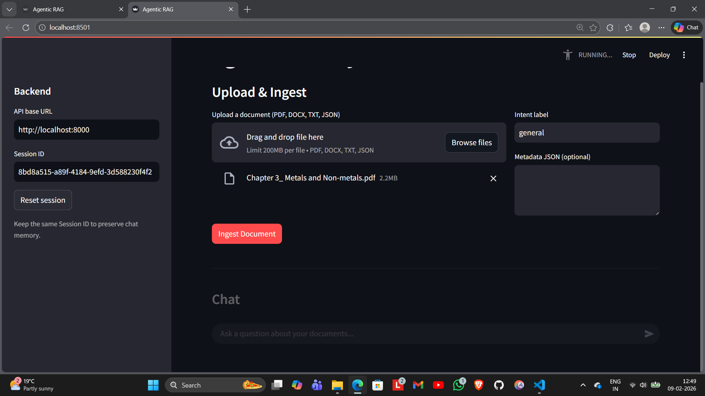
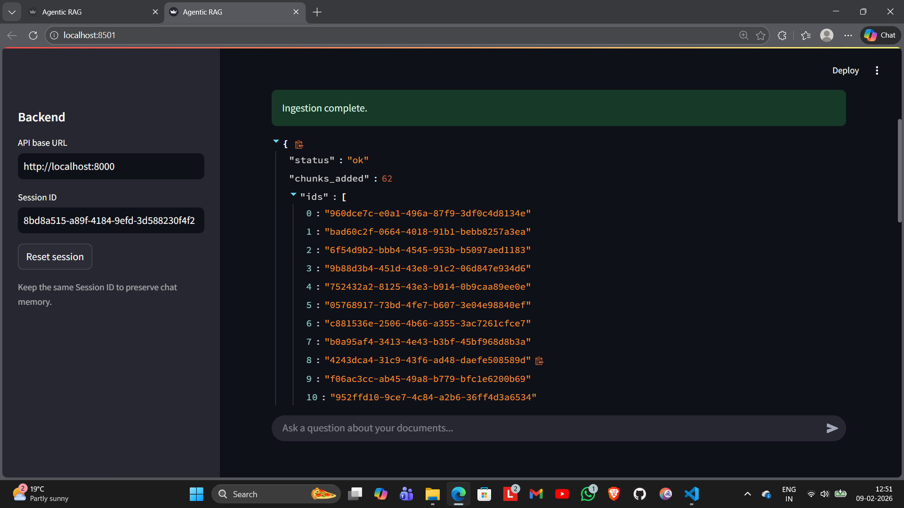
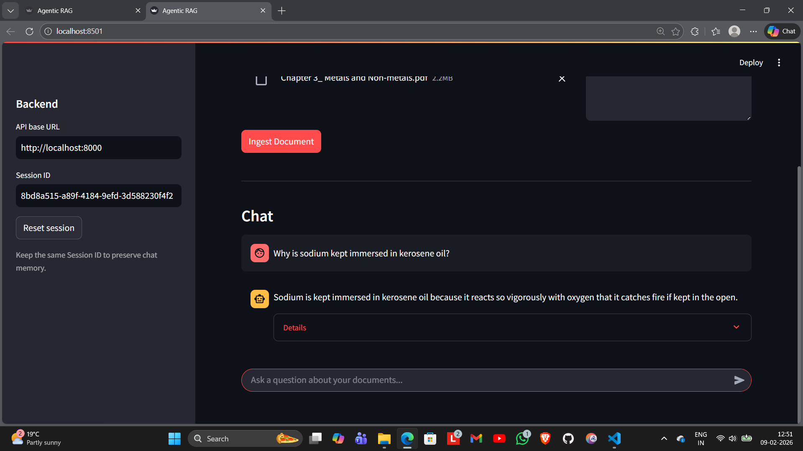
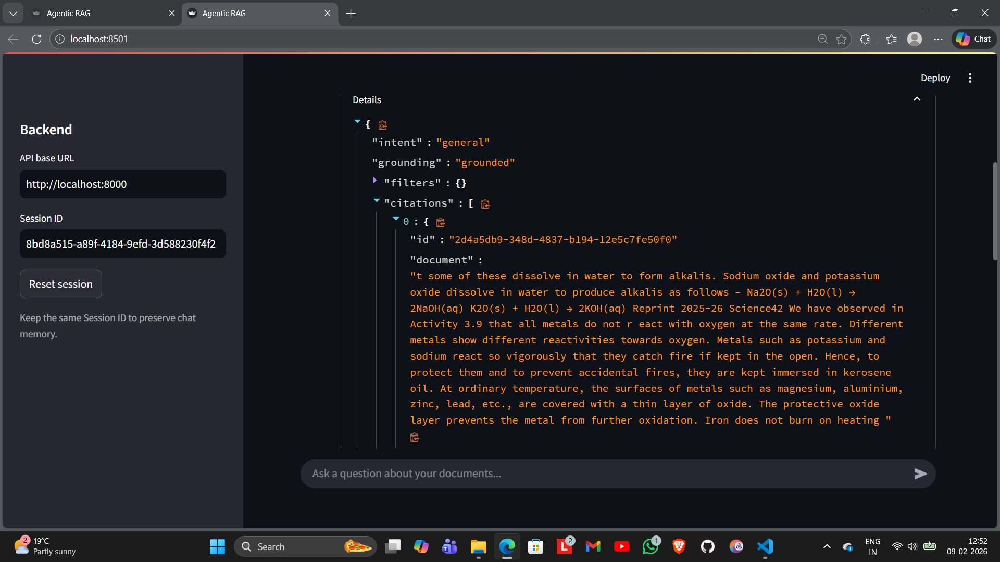
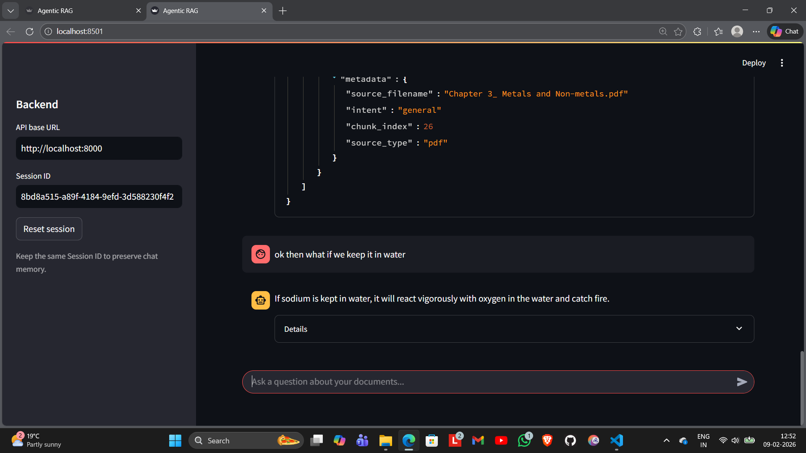
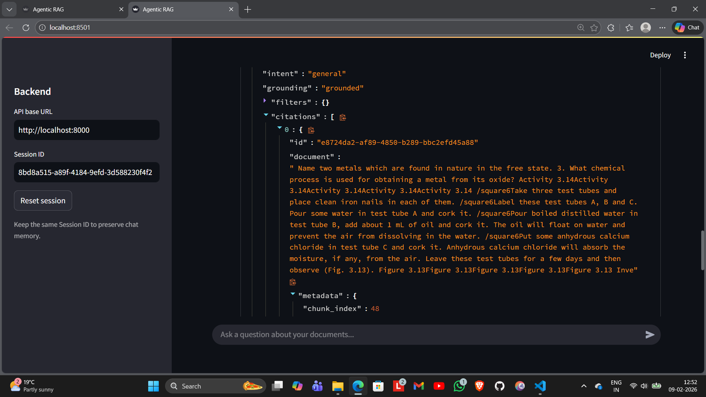

# Agentic RAG System

An Agnetic AI sytem with FastAPI backend + Streamlit UI for document ingestion and grounded Q&A with Groq Llama 3.18b instant and ChromaDB.

## Features
- Ingest PDF, DOCX, TXT, JSON into ChromaDB with metadata and chunking
- Query with Llama 3.1 (Groq) to extract intent + filters for targeted retrieval
- Grounded answers with citations; ungrounded responses are explicitly labeled
- Server-side short‑term memory with citation carryover for follow‑ups
- Streamlit UI for uploads and chat

## Architecture
- **FastAPI** backend (`/ingest`, `/chat`)
- **ChromaDB** persistent vector store
- **mixedbread-ai/mxbai-embed-large-v1** for embeddings
- **Groq Llama 3.1 8B Instant** for intent extraction and answer generation

## Project Structure
```
.
├─ backend/
│  ├─ api/
│  │  ├─ chat.py
│  │  └─ ingest.py
│  ├─ core.py
│  └─ main.py
├─ chroma_db/
├─ data/
├─ streamlit_app.py
├─ main.py
└─ requirements.txt
```

## Setup
1) Create a virtual environment and install dependencies:
```
python -m venv venv
venv\Scripts\activate
python -m pip install -r requirements.txt
```

2) Configure environment variables:
```
GROQ_API_KEY=your_key_here
```

## Run the Backend
```
python -m uvicorn backend.main:app --reload
```

## Run the Streamlit UI
```
streamlit run streamlit_app.py
```

## API Usage

### POST /ingest
Uploads a document and stores embeddings + metadata in ChromaDB.

Form fields:
- `file` (required)
- `intent` (optional, default: `general`)
- `metadata_json` (optional JSON string)

### POST /chat
Asks a question and returns answer + citations.

Request body:
```
{
  "query": "can you tell me about annual leave policy",
  "session_id": "your-session-id",
  "n_results": 4
}
```

Response body:
```
{
  "intent": "hr",
  "user_query": "annual leave policy",
  "filters": {"category": "leave"},
  "grounding": "grounded",
  "answer": "...",
  "citations": [
    {
      "id": "...",
      "document": "...",
      "metadata": {...}
    }
  ]
}
```

## Notes
- For best retrieval, set an appropriate `intent` during ingestion (e.g., `hr`, `incident`).
- If no relevant documents are found, the system returns an **ungrounded** response.
- Conversation memory is server-side and keyed by `session_id`.

## Troubleshooting
- If `uvicorn` is not recognized, use:
```
python -m uvicorn backend.main:app --reload
```
- If ingestion fails for PDF/DOCX, ensure `pypdf` and `python-docx` are installed.

## Testing this with a simple example

### upload any document 
- for example i have uploaded ncert class 10 chapter metals and non-metals for ingestion 


- on success it returns a response with no. of chunks added and ids of various chunks


### asking a simple query to test
- for example i am asking it "Why is sodium kept immersed in kerosene oil?"


- citations for grounding answers


## conversational memory test
- asking a follow up to test short-term conversational memory


- citations for grounding follow up answers

